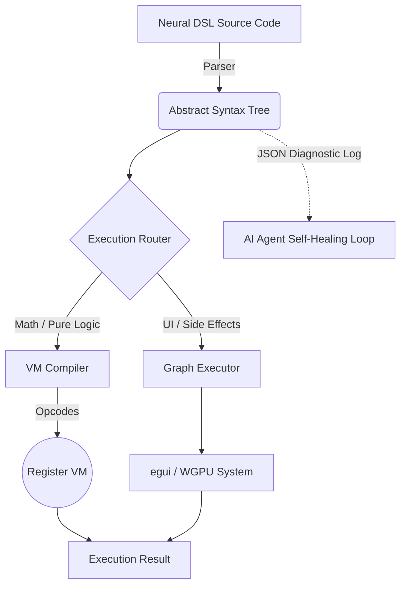

# KnotenCore 🦀🤖
**The Agent-First Rust Engine.**

## 1. What is KnotenCore?
**KnotenCore** is a high-performance, **Agent-Native** execution engine built entirely in Rust. It compiles and evaluates UI logic, graphics, audio, and state transformations instantly without an intermediate browser layer. Designed not for human boilerplate, but as a deterministic powerhouse that AI Agents can compile to efficiently and autonomously.

## 2. Why it exists ("Agent First")
The current app development ecosystem is heavily burdened with human-centric boilerplate, fragmented tooling, and bloated artifact pipelines. KnotenCore eliminates all of this overhead. By providing a **deterministic, token-efficient runtime expressly built for AIs**, it shifts the paradigm from "AI writing React code for humans" to "AI writing Neural DSL code for a bare-metal Agent VM."
It enables AI agents to read clear diagnostic JSON logs, self-heal instantly upon failure, and deliver highly optimized graphical applications (under 5MB).

## 3. The Power in Action: KnotenCalculator Pro v2.2
Our flagship demo, the **KnotenCalculator Pro v2.2 with Kinetic History**, proves the capabilities of the engine. Featuring a natively scrolling kinetic history tape, variable data states, and complex UI layouts, the Calculator evaluates the DOM entirely within KnotenCore's hybrid VM infrastructure at roughly 60+ FPS – powered exclusively by Agent-generated logic.

## 4. The Neural DSL
KnotenCore eschews heavy JSON trees for an Ultra-Dense Neural Syntax (`.knoten`). Designed for maximum structural compression and token efficiency, the DSL gives AI models immediate and obvious control flow mechanics.

```rust
// An elegant Agent snippet in Neural DSL
win = UIWindow("main_nav", "Control Panel") -> {
    grid(2, "layout_grid") -> {
        btn1 = UIButton("Initialize System");
        btn2 = UIButton("Launch Diagnostics");
        
        if (btn1) -> {
            FSWrite("sys.log", "System initialized.");
        }
    }
}
```

## 5. Architecture: The Hybrid AST/Register VM
KnotenCore dynamically routes code to the single most performant executor path. High-level UI declarations remain an AST, while intensive logical/mathematical constraints bypass the tree evaluator and compile directly into flat **Opcodes** for the Register VM.



### Supported Platforms
- Windows `x86_64`
- macOS `x86_64` & `aarch64`
- Linux `x86_64`

### Build from Source
```bash
cargo build --release
```
