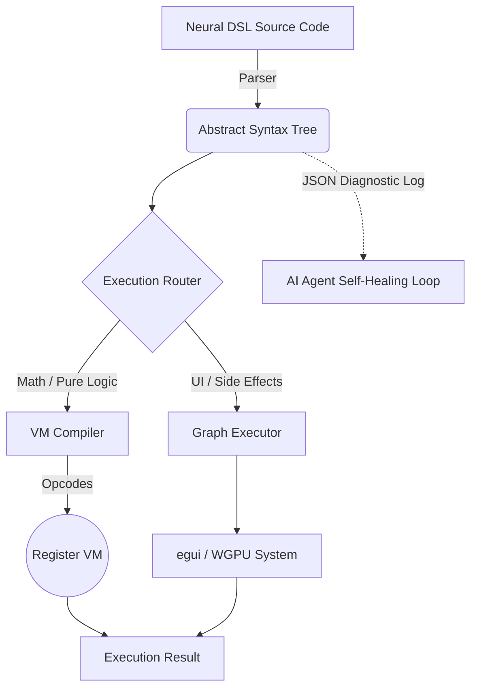

# KnotenCore 🦀🤖
**The Agent-First Rust Engine.**

## 1. What is KnotenCore?
**KnotenCore** is a high-performance, **Agent-Native** execution engine built entirely in Rust. It compiles and evaluates UI logic, graphics, audio, and state transformations instantly without an intermediate browser layer. Designed not for human boilerplate, but as a deterministic powerhouse that AI Agents can compile to efficiently and autonomously.

### Why "KnotenCore"? (No, it's not a German techno genre)
Despite sounding like an aggressive underground music style from Berlin, the name actually makes perfect sense for our architecture:
- **Knoten** is the German word for **Node**. Since our Neural DSL is basically a massive, highly efficient graph of Abstract Syntax Tree (AST) *nodes*, we just went with the German translation because... well, it sounds about 20% more over-engineered.
- **Core** represents the blazingly fast, bare-metal Rust execution environment that deterministically chews through these nodes without mercy.

So welcome to KnotenCore: Hardcore Nodes. We promise it won't tangle your logic.

## 2. Modular Engine Architecture (Sprint 72)
To maintain long-term stability and reduce compilation times, the core engine has been modularized into specialized components:

- **`src/executor.rs`**: The backbone of the engine. Acts as a lightweight **Coordinator** and **State-Holder** (`ExecutionEngine`). It orchestrates data flow between all other modules.
- **`src/evaluator.rs`**: The brain. Handles **AST Parsing**, recursive evaluation, and pure logical/mathematical execution.
- **`src/renderer.rs`**: The eyes. Unified **WGPU** logic, shader management, Hardware-Instancing, and high-performance draw calls.
- **`src/window.rs`**: The skin. Manages the **winit Event-Loop**, application lifecycle, and hardware input (MouseGrab/Keyboard).
- **`src/async_bridge.rs`**: The nervous system. Handles non-blocking operations like `Fetch` and `Extract` via background worker threads.

## 3. Security & Sandboxing (Sprint 76, 80 & 83)
KnotenCore is built for AI-driven execution, which requires strict security:
- **Sprint 80 (Phase 1): Security Lockdown (ExternCall Bypass)**. Verified sandbox enforcement for all I/O entry points. [x]
- **Sprint 80 (Phase 2): VRAM Rescue (Geometry Caching)**. Optimized 3D primitive rendering with geometry reuse and dynamic scaling. [x]
- **Sprint 81: Primitive Resurrection & Mat4Mul**. Restored Sphere/Cylinder geometry generation and implemented 4x4 matrix multiplication in the evaluator. [x]
- **Sprint 83: Emergency Security & Architecture Fix**. Closed 6 Audit Round 6 findings (network sandbox, FS path traversal, VM panics, unsound Sync, scope logic). [x]
- **Sprint 85: Real Renderer Port**. Fixed fake rendering pipeline: added normals to vertex layout, `generate_cube()`, correct camera bind group (4 bindings), view-proj UBO write, resize surface_format, removed ~20 dead WGPU fields from ExecutionEngine. [x]

The runner enforces a **"Deny-by-Default"** policy for all I/O:
- **`FS Read/Write`**: Disabled by default. Paths are canonicalized and verified to not escape the working directory, preventing `../../etc/passwd`-class attacks.
- **`Network (Fetch)`**: Disabled by default.
- **`ExternCall Protection`**: FFI bridge calls are subject to the same sandbox rules as standard nodes.
- **`Permissions`**: Must be explicitly granted via CLI flags:
  - `--allow-read`: Enables `FSRead`, `IO.ReadFile`, and `registry_read_file`.
  - `--allow-write`: Enables `FSWrite`, `IO.WriteFile`, and `registry_write_file`.
  - `--allow-network`: Enables `Node::Fetch` and outbound HTTP calls.
- **`Structured Faults`**: Unauthorized access returns `ExecResult::Fault` with specific permission denial messages for AI self-healing.


## 4. Unified Physics System (Sprint 77)
KnotenCore features a unified AABB (Axis-Aligned Bounding Box) physics engine that bridges the voxel world and generic 3D space:
- **`AABB Collision`**: Scripts can register custom physical barriers using `AddWorldAABB`.
- **`FPS Integration`**: The camera movement automatically respects these boundaries, allowing for complex level design beyond simple voxels.
- **`Performance`**: Collision checks are optimized to handle hundreds of active world-AABBs per frame.

## 5. Error Tracing Foundation (Sprint 78)
KnotenCore provides deep diagnostic context for runtime failures to enable **Self-Healing AI Agents**:
- **Structured Faults**: Errors now include node context for AI self-healing.
- **Native 3D Primitives**: High-performance sphere, cube, and cylinder generation offloaded to the engine (Sprint 79 & 81).
- **Matrix Multiplication**: Restored `Mat4Mul` node for efficient 3D transformations (Sprint 81).
- **`Diagnostic logs`**: Runtime errors include the node type, allowing agents to pinpoint the failing logic in the Neural DSL immediately.
- **`Scalability`**: This foundation serves as the basis for future automated refactoring and error correction by LLM-based executors.

## 6. Automatic Memory Management (ARC)
Unlike raw handle systems, KnotenCore utilizes a **Managed Handle Topology**. Native resources (Windows, Textures, Counters) are wrapped in a `NativeHandle` struct that implements the `Drop` trait. When a handle variable goes out of scope in the DSL, the engine automatically decrements the reference count and cleans up the resource in the registry.

## 7. Why it exists ("Agent First")
The current app development ecosystem is heavily burdened with human-centric boilerplate, fragmented tooling, and bloated artifact pipelines. KnotenCore eliminates all of this overhead. By providing a **deterministic, token-efficient runtime expressly built for AIs**, it shifts the paradigm from "AI writing React code for humans" to "AI writing Neural DSL code for a bare-metal Agent VM."
It enables AI agents to read clear diagnostic JSON logs, self-heal instantly upon failure, and deliver highly optimized graphical applications (under 5MB).

## 8. The Neural DSL
KnotenCore eschews heavy JSON trees for an Ultra-Dense Neural Syntax (`.knoten`). Designed for maximum structural compression and token efficiency, the DSL gives AI models immediate and obvious control flow mechanics.

```rust
// An elegant Agent snippet in Neural DSL
win = UIWindow("main_nav", "Control Panel") -> {
    grid(2, "layout_grid") -> {
        btn1 = UIButton("Initialize System");
        btn2 = UIButton("Launch Diagnostics");
        
        if (btn1) -> {
            FSWrite("sys.log", "System initialized.");
        }
    }
}
```

## 9. Architecture: The Hybrid AST/Register VM
KnotenCore dynamically routes code to the single most performant executor path. High-level UI declarations remain an AST, while intensive logical/mathematical constraints bypass the tree evaluator and compile directly into flat **Opcodes** for the Register VM.



### Supported Platforms
- Windows `x86_64`
- macOS `x86_64` & `aarch64`
- Linux `x86_64`

### Build from Source
```bash
cargo build --release
```

## 10. Testing & Validation
To verify the integrity of the engine's **Error Tracing** and **Security Sandbox**, you can run the intentional crash test:

```bash
cargo run --bin run_knc -- tests/intentional_crash.knoten
```

**Expected Output:**
```text
Result: Fault: Div by zero (at Node::MathDiv)
```
This confirms that the engine correctly identifies the failing AST node and reports it without a system-level panic.
