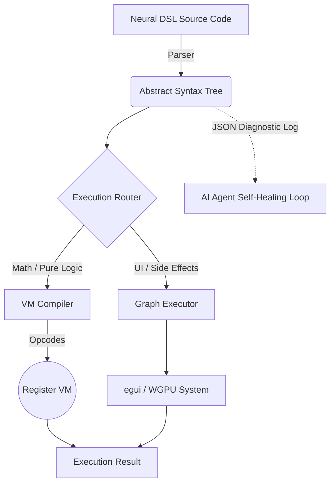

# KnotenCore 🦀🤖

*(Noun) /knoːtən kɔːr/*

1. **Not** a relentless underground German hardcore techno subgenre. 
2. A blazing-fast, thread-safe, and heavily sandboxed 3D scripting engine that pumps out frames instead of 160 BPM basslines. 

*(Please leave your glowsticks at the door before compiling).*

**The Agent-First Rust Engine.**

## What is KnotenCore?
**KnotenCore** is a high-performance, **Agent-Native** execution engine built entirely in Rust. It compiles and evaluates UI logic, graphics, audio, and state transformations — without an intermediate browser layer. Designed not for human boilerplate, but as a deterministic powerhouse that AI agents can target efficiently and autonomously.

### Why "KnotenCore"?
**Knoten** is the German word for **Node**. The runtime is architecturally a massive, highly-efficient graph of Abstract Syntax Tree (AST) *nodes*. **Core** represents the blazingly fast, bare-metal Rust execution environment that deterministically processes these nodes.

---

## Engine Architecture

The core engine is modularized into specialized components:

| Module | Role |
|---|---|
| `src/executor.rs` | **Coordinator & State-Holder** — Orchestrates data flow between all modules |
| `src/evaluator.rs` | **Interpreter (JIT)** — AST parsing, recursive evaluation, and pure logical/mathematical execution |
| `src/vm/mod.rs` | **Virtual Machine (AOT)** — *[New]* Dedicated Ahead-of-Time Bytecode compiler scaling complex loops past AST limits. Incorporates a unified Stack Machine / ALU and Compiler Backpatching. |
| `src/renderer.rs` | **Eyes** — WGPU logic, shader management, hardware-instancing, and high-performance draw calls |
| `src/window.rs` | **Skin** — winit event-loop, application lifecycle, hardware input |
| `src/async_bridge.rs` | **Nervous System** — Non-blocking `Fetch` and `Extract` via background worker threads |

---

## Key Features

### 🔒 Thread-Safe & Sandboxed
KnotenCore is built for AI-driven execution with strict, audited security:
- **Deny-by-Default** policy for all I/O. All permissions must be explicitly granted via CLI flags.
- **`--allow-read`**: Enables `FSRead`, `IO.ReadFile`, and `registry_read_file`. Paths are canonicalized and verified against the working directory to prevent path-traversal attacks.
- **`--allow-write`**: Enables `FSWrite`, `IO.WriteFile`, and `registry_write_file`. Write targets are normalized and boundary-checked.
- **`--allow-network`**: Enables `Node::Fetch` and all outbound HTTP calls.
- **`ExternCall Protection`**: FFI bridge calls pass through the same sandbox rule-set as standard nodes — there is no bypass.
- **`Structured Faults`**: Unauthorized access returns `ExecResult::Fault` with specific permission-denial messages, enabling AI self-healing.

### 🎮 WGPU Hardware Rendering
KnotenCore renders via WGPU — a modern, cross-platform GPU API targeting Vulkan, DirectX 12, and Metal natively:
- **Blinn-Phong Shading**: Production-quality per-pixel lighting pipeline.
- **Native 3D Primitives**: High-performance `Sphere`, `Cube`, and `Cylinder` with geometry caching — vertices and indices are computed once per unique configuration and reused from VRAM.
- **`Mat4Mul`**: 4×4 matrix multiplication for hierarchical 3D transformations.
- **Z-Buffered Depth Ordering**: `TextureFormat::Depth32Float` with `CompareFunction::Less`.
- **Camera UBO**: Real `perspective_rh × look_at_rh` view-projection matrices written per-frame.
- **Resize-Safe**: Surface and depth buffers are correctly re-created on window resize.

### ⚡ JIT & AOT Execution
KnotenCore dynamically routes code to the most performant executor path:



High-level UI declarations remain in the AST (JIT). Intensive mathematical expressions bypass the tree evaluator and compile directly into flat **Opcodes** for a Register VM. The AOT pipeline leverages **LLVM Constant Folding** — pure computation loops that evaluate to a constant at compile time are entirely eliminated in the release binary.

### 🧠 Automatic Memory Management (ARC)
KnotenCore uses a **Managed Handle Topology**. Native resources (Windows, Textures, Counters) are wrapped in `NativeHandle` structs that implement Rust's `Drop` trait. When a handle variable goes out of scope in the DSL, the engine automatically decrements its reference count and releases the resource from the registry — no garbage-collector pauses, no leaks.

### 🛡️ Robust, Self-Healing Error Reporting
All runtime failures produce a structured `ExecResult::Fault` containing:
- **`msg`**: Human-readable description of what went wrong.
- **`node`**: The exact AST node or native function where the fault originated (e.g., `"Node::MathDiv"`, `"Native::IO::ReadFile"`).

This enables AI agents to pinpoint failures instantly and self-correct without manual intervention.

### 🌐 Unified Physics (AABB)
- **`AddWorldAABB`**: Scripts register arbitrary physical barriers as collision volumes.
- **FPS Camera Integration**: Camera movement automatically respects all registered world-AABBs.
- **Performance**: Optimized for hundreds of active collision volumes per frame.

---

## The Neural DSL

KnotenCore uses an ultra-dense Neural Syntax (`.knoten`) — a closure-based DSL designed for maximum structural compression and token efficiency:

```rust
// An elegant snippet in Neural DSL
win = UIWindow("main_nav", "Control Panel") -> {
    grid(2, "layout_grid") -> {
        btn1 = UIButton("Initialize System");
        btn2 = UIButton("Launch Diagnostics");
        
        if (btn1) -> {
            FSWrite("sys.log", "System initialized.");
        }
    }
}
```

---

## Supported Platforms

| Platform | Architecture |
|---|---|
| Windows | `x86_64` |
| macOS | `x86_64`, `aarch64` |
| Linux | `x86_64` |

---

## Build from Source

```bash
cargo build --release
```

---

## Testing & Validation

To verify the engine's **Error Tracing** and **Security Sandbox**, run the intentional fault test:

```bash
cargo run --bin run_knc -- tests/intentional_crash.knoten
```

**Expected Output:**
```text
Result: Fault: Div by zero (at Node::MathDiv)
```

This confirms that the engine correctly identifies the failing AST node and reports it without a system-level panic.

---

## Why it Exists — Agent First

The current app development ecosystem is burdened with human-centric boilerplate, fragmented tooling, and bloated artifact pipelines. KnotenCore eliminates this overhead entirely. By providing a **deterministic, token-efficient runtime expressly designed for AI agents**, it shifts the paradigm from "AI writing React code for humans" to "AI writing Neural DSL code for a bare-metal Agent VM." It allows agents to read clear diagnostic JSON logs, self-heal instantly upon failure, and ship highly-optimized graphical applications under 5 MB.
